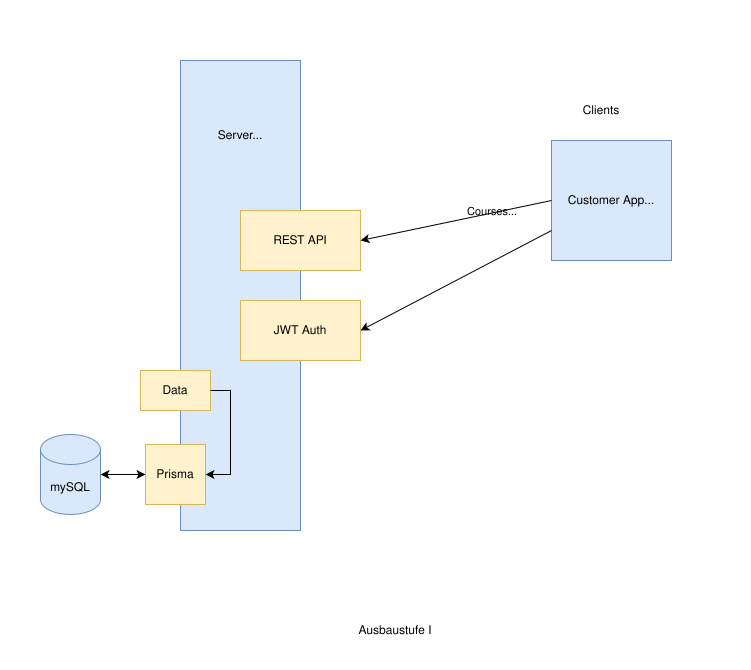
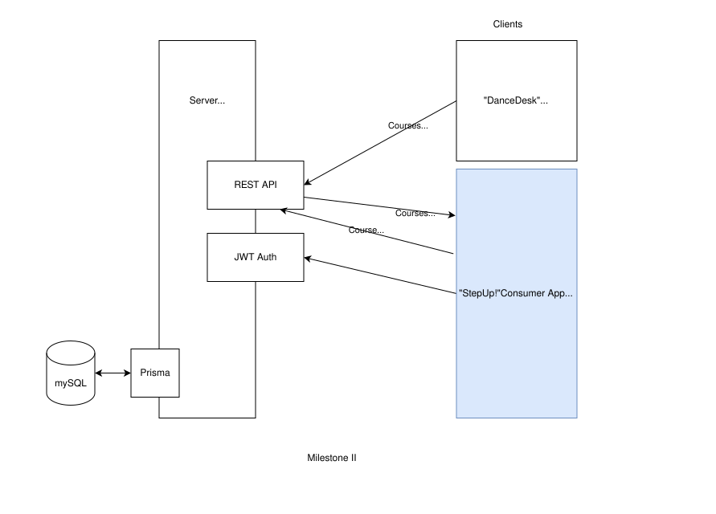
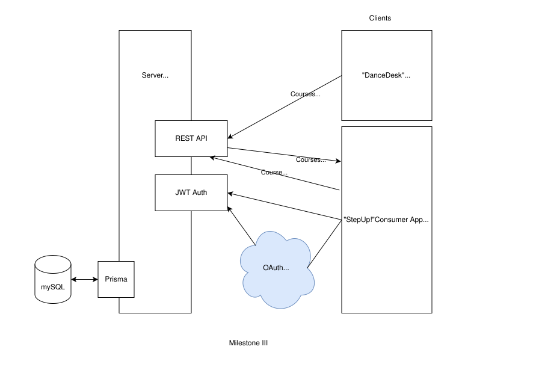
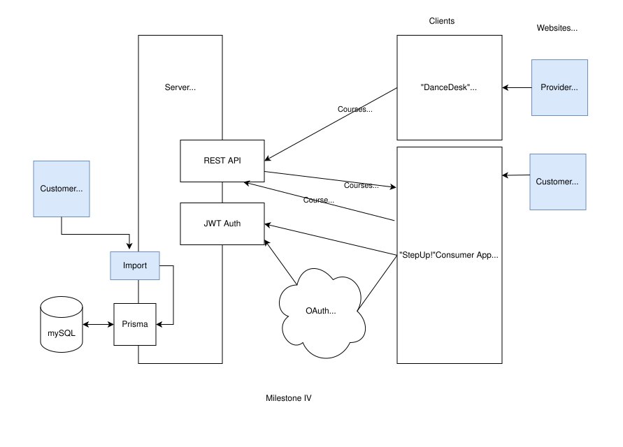

# wbs-dancedesk
A wbs-coding school final project of SDG-26

## Eye-Candy for the customer-app
Main goal of the redesign is to offer a clean, modern interface with minimum of technical details as possible. Getting rid of old technocratic approaches and redundancies. Intuitive using of the surface is first rule. Avoid disturbing details where possible. Gamification supports the mindset of the target audience.
* the app opens with a friendly icon and a slogan. There are only two other items on the header: the upload button and Login/Logout
* nicely designed dashboard item for new registrations to be imported/updated to customer database. Confirm registration to consumer using a template, add a todo list for processing payments
* nicely designed dashboard item for all courses this week. Item contains course title, a status, when not default, time slot, instructor and room. Dashboard can by dynamically filtered for course title/room/instructor. On filter change, boxes move animatedly to their new positions.
* on selecting an item, an animated menu pops up to either edit the course data or open the attendance list for that course, prefilled with all registrations
* on adding new items, suggest title and other values based on existing items in this category of items. Used for target groups, groups and courses
* change instructors by dragging them from a sidebar onto a course; all instances of this course get a now instructor
* change room by dragging them from a sidebar onto a course; all instances of this course get a new room
* marking a day as holiday asks for a title and removes all courses from that day
* moving next week/prev week has a slider effect
* animated sidebar menu on the left with tabbed main menu points: registration, course, customer, instructor, room, info, term, settings. Tabs can be dragged to new positions. Allow creation of new items
* course menu offers a design mode: a) options on hover: like hovering over target group to inactivate b) dragging it to a new position; in design mode, target groups can be reactivated. Open/close state of menu is being stored in a state and in local storage on change
* registrations: allow manual registration of a new participant (re-uses registration component)
* a powerful calendar gives full overview over unused rooms

## Milestones

### Milestone 1 - reached!

### Milestone 2 - mostly reached!

### Milestone 3

### Milestone 4

## Tools used
* Trello: https://trello.com/b/OBGj6jTR/mein-trello-board
